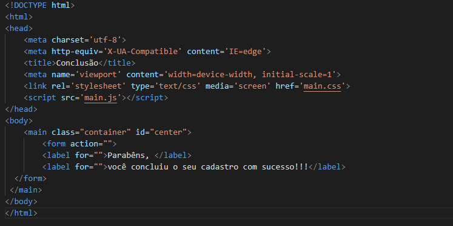
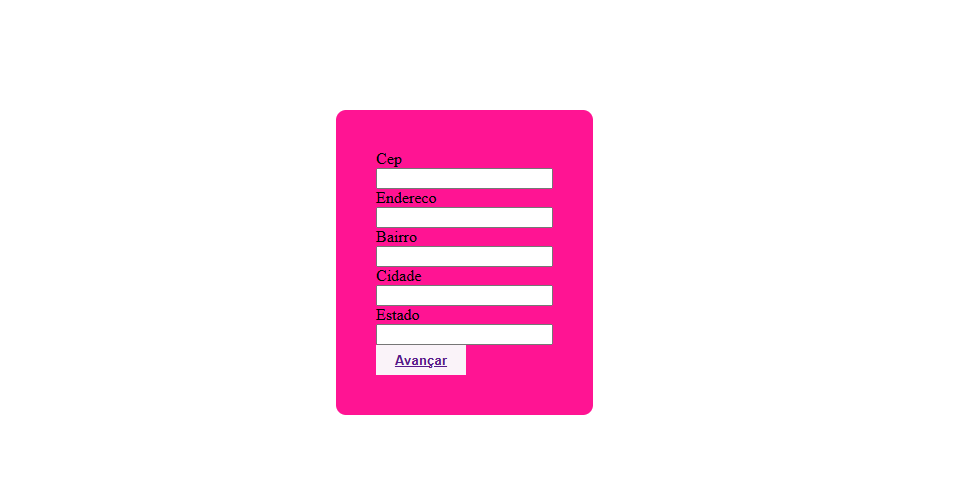

# form-CadEcommerce-
 Projeto criado como parte avaliativa da disciplina de Fundamentos de desenvolvimento ministrada pelo professor Leonardo Rocha.
tem menu de contexto
## Índice

* [Descrição](#descrição)

* [Tecnologias](#tecnologias)

* [Referências](#referências)

* [Autor(a)](#autora)

### Descrição
O projeto consiste em criarmos um "site", simulando uma tela de cadastro para realizar uma compra
(Site e-commerce).
 
#### Tabela

Veja a imagem da primeira parte do codigo que consiste no inicio do site onde tem que inserir seu nome, telefone, e-mail, cpf e criar uma senha e avançar:

Veja a imagem da segunda parte do codigo que consiste em inserir seu estado, cidade e endereço e avançar! essa e a segunda etapa para concluir seu cadastro no site:

Veja a imagem da ultima parte que consiste em se seu cadastro foi conluido no site, ali te parabenizam!

Veja a imagem da estilizaçao do projeto, consiste nas cor e tamanho do nosso cadastro do site

### Resultado do projeto

## Tecnologias

* HTML5

* CSS3

## Referências

 [Alura](

https://www.alura.com.br/artigos/escrever-bom-readme

) - Como escrever um README incrivel no seu gitHub  

## Autor(a)

`O projeto foi desenvolvido por:`

* Yasmim Faria